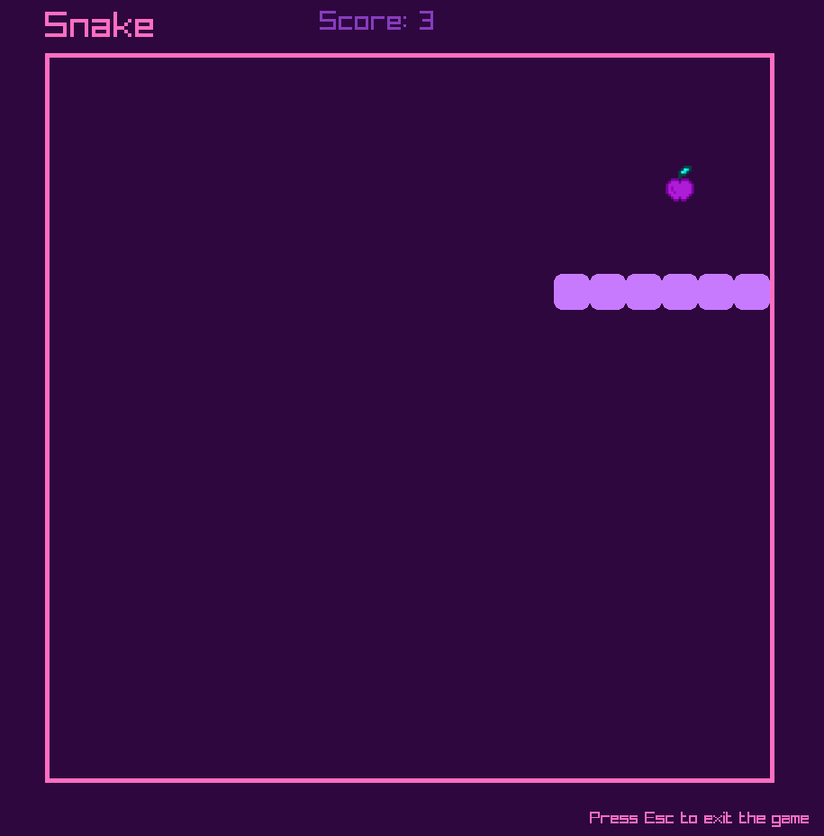

# Snake Game with Raylib 🐍🎮

This project implements a classic **Snake Game** using **C++** and the **Raylib** library. The game features smooth snake movement, random food generation, and collision detection with self, walls, and food. Sound effects are triggered upon eating food and colliding with obstacles.

## Project Overview 🎯

The **Snake Game** aims to provide a simple, fun, and interactive experience where players control a snake to eat food while avoiding collisions with walls and the snake’s own body. As the snake eats more food, it grows longer, increasing the game's difficulty.

## Project Components ⚙️

1. **Game Logic (`main.cpp`)**: Contains the primary game logic, including the snake's movement, food generation, and collision detection.
   
2. **Snake and Food Classes**: 
   - **Snake**: Controls the snake's body, movement, and rendering.
   - **Food**: Handles random placement of food and rendering.
   
3. **Audio Integration**: Sound effects are played when the snake eats food or collides with a wall/self.

4. **Graphics and Animations**: The game features simple 2D graphics using the **Raylib** library, with customizable colors and textures.

5. **Collision Detection**: The game checks for collisions between the snake and itself, the snake and the walls, and the snake and food to trigger events.

## Features 🌟

- **Snake Movement**: The snake can be controlled using the arrow keys to move in four directions: up, down, left, and right.
- **Food Generation**: Food is randomly placed on the game board, and the snake grows in length each time food is eaten.
- **Score Tracking**: The player's score increases as the snake eats food.
- **Sound Effects**: Sound plays when food is eaten or when the snake hits a wall or itself.
- **Game Reset**: The game resets when the snake collides with itself or the walls.
- **Pause Functionality**: The game automatically pauses at the start and resumes when the player makes the first move.

## Usage 🧑‍💻

1. **Download and Install Dependencies**:
    - You need to install **Raylib** and set up your C++ development environment.

2. **Run the Game**:
    - Compile the game using the provided Makefile or compile manually using your preferred build system.

3. **Control the Snake**:
    - Use the arrow keys to control the snake:
        - **Up**: Move upward.
        - **Down**: Move downward.
        - **Left**: Move left.
        - **Right**: Move right.

4. **Game Objective**:
    - Guide the snake to eat the food and avoid collisions. The game will reset upon collisions with the snake's body or the walls.

## Dependencies 📦

- **Raylib**: A simple and easy-to-use library to enjoy videogames programming.
- **C++ Compiler**: You will need a C++ compiler like g++, MSVC, or clang.
- **Assets**:
   - `assets/apple.png`: The image for food.
   - `assets/audio/eat.mp3`: The sound played when food is eaten.
   - `assets/audio/wall.mp3`: The sound played when the snake hits a wall or itself.

## Installation and Running the Game 🛠️

1. **Clone the Repository**:
    ```bash
    git clone https://github.com/your-username/snake-game-raylib.git
    cd snake-game-raylib
    ```

2. **Install Raylib**: Follow the installation instructions for your platform from the official Raylib website: [https://www.raylib.com/](https://www.raylib.com/).

3. **Compile the Game**:
    ```bash
    g++ main.cpp -o snake_game -lraylib -lGL -lm -lpthread -ldl -lrt -lX11
    ```

4. **Run the Game**:
    ```bash
    ./snake_game
    ```

## Screenshots 📸



## Contributing 🫂

Contributions to enhance the game or add new features are welcome! Feel free to open issues or submit pull requests.

## Acknowledgements ⭐

- Special thanks to the creators of **Raylib** for providing a great library for building simple games with C++.
- Thanks to the open-source community for providing assets and inspiration for this project.
